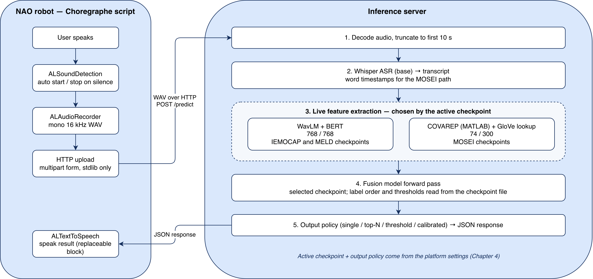
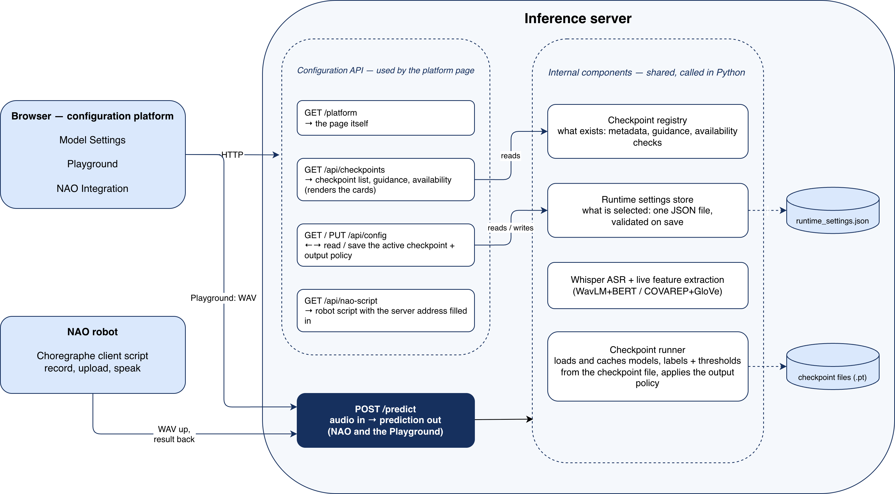

# HRI-EMO-NAO-PIPELINE

A deployed multimodal emotion recognition pipeline for the **NAO** robot, with a
web platform where an experimenter chooses the model and the output format
without editing code.

The robot records speech and speaks a reaction. Everything in between —
transcription, feature extraction, inference — runs on a separate server, because
NAO's onboard computer cannot host these models. One HTTP endpoint connects the
two.

---

## The pipeline



A Choregraphe script on the robot detects speech, records a mono 16 kHz WAV, and
posts it to the server. The server decodes the audio, truncates it to ten
seconds, transcribes it with Whisper, extracts audio and text features live, runs
the selected checkpoint, and returns JSON. The robot speaks the result.

Which feature extractor runs is decided by the active checkpoint: WavLM + BERT
for the IEMOCAP and MELD models, COVAREP + GloVe for the MOSEI models. Nothing on
the robot has to change when the model changes.

## The server and the platform



The robot and the browser both post to the same `/predict` endpoint. A separate
configuration API backs the platform page, where the active checkpoint and the
output policy are selected and saved to a JSON file that takes effect on the next
request. No restart, and no edit to the robot script.

The platform has three tabs: **Model Settings** to pick the checkpoint and output
format, **Playground** to record from the browser and see the transcript and the
prediction, and **NAO Integration** to generate the Choregraphe script with the
server address already filled in.

---

## Quick start

```bash
python -m venv venv && source venv/bin/activate   # Windows: venv\Scripts\activate
pip install -r requirements.txt
uvicorn server.main:app --host 0.0.0.0 --port 8000
```

Then open **http://localhost:8000/platform**.

To check the whole chain in one click, without a microphone:
**http://localhost:8000/platform?demo=1#playground** — it sends a built-in clip
through the pipeline and shows the transcript and the prediction.

Trained weights live in `runs/`, which is gitignored, so a fresh clone does not
have them. A checkpoint whose file is missing is shown as unavailable on the
platform and the rest keeps working. Full setup, including the optional MATLAB
and GloVe requirements for the MOSEI models, is in
**[server/README.md](server/README.md)**.

## Checkpoints

| Checkpoint | Task | Features | Notes |
|---|---|---|---|
| MELD 4-class | angry / happy / neutral / sad | WavLM + BERT | Recommended for live interaction |
| MELD sentiment | negative / positive | WavLM + BERT | Most reliable of the five |
| IEMOCAP 4-class | angry / happy / neutral / sad | WavLM + BERT | Acted speech, quiet room |
| MOSEI 6-emotion | multi-label over six emotions | COVAREP + GloVe | ~7 s per utterance; for recorded audio |
| MOSEI sentiment | negative / positive | COVAREP + GloVe | Same latency caveat |

The two MOSEI models call MATLAB for COVAREP features, so they are meant for
post-session analysis rather than live interaction. Metrics and usage guidance
for each are in `server/checkpoint_registry.py` and on the platform cards.

## Repository layout

```
server/          FastAPI server, configuration platform, NAO client script
models/          Model components: cross-modal block, beta gate, decoder
scripts/         Feature extraction, training, offline and online evaluation
tools/           COVAREP bridge and plotting utilities
tests/           Unit tests for the model components
runs/            Trained checkpoints (gitignored)
```

## The recognition model

The model is an adaptive cross-modal Transformer: intra-modal self-attention and
bidirectional cross-attention align the audio and text streams, a vector-wise
β-gate weights the two modalities per feature dimension, and an emotion-level
decoder gives each emotion its own query vector. Single-label checkpoints use a
softmax head, the MOSEI 6-emotion checkpoint uses per-class sigmoids with
thresholds calibrated on the validation set.

The architecture comes from an earlier MEng project in the same lab
([Makiato1999/HRI-EMO](https://github.com/Makiato1999/HRI-EMO)). This repository
retrains it, deploys it as a live service, measures what the deployment costs,
and adds the configuration platform.
